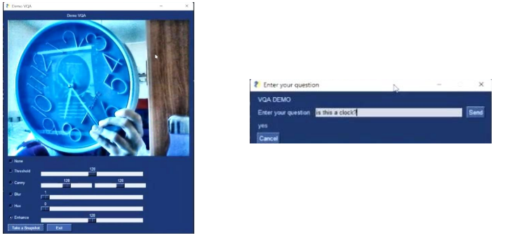
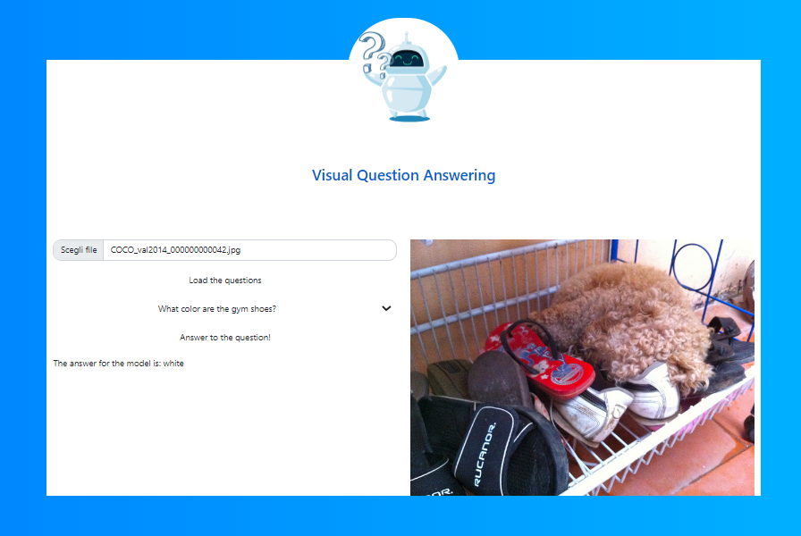

# **What’s Visual Question Answering?**

Visual Question Answering (VQA) is a computer vision task where 
a system is given a text-based question about an image, 
and it must infer the answer.

## **Web Application Demo**

 
## **Web Application Demo**

